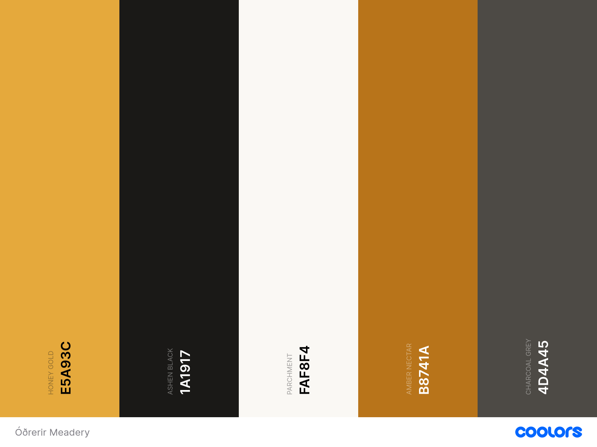

# Óðrerir Meadery

## By Ed Chalk

[View the live project here](PLACEHOLDER)

[View the repository here](https://github.com/edchalk96/mimirs_index/tree/main)

## Table of Contents

1. [Background](#background)
2. [User Experience (UX) | The 5 Planes](#user-experience-ux--the-5-planes)
    1. [Strategy Plane](#strategy-plane)
    2. [Scope Plane](#scope-plane)
    3. [Structure PLane](#structure-plane)
    4. [Skeleton Plane](#skeleton-plane)
    5. [Surface PLane](#surface-plane)
3. [Technologies Used](#technologies-used)
4. [Testing](#testing)
5. [Deployment](#deployment)
6. [Credits](#credits)

---

## Background

Óðrerir Meadery is a conceptual e-commerce website dedicated to selling various types of craft mead (honey wine) and accessories to a UK-based audience (ages 18+). Developed as Milestone Project 4 for the Code Institute Full-Stack Web Development diploma, this site serves as a proof of concept. However, it has been built to commercial standards so it can be deployed as a live e-commerce store if the business goes live in the future.

---

## User Experience (UX) | The 5 Planes

The planning and development of the Óðrerir Meadery website followed the core principles of UX design, utilizing Jesse James Garrett's framework from The Elements of User Experience. To ensure a thorough and well-structured design process, this framework was supplemented by Urooj Qureshi’s practical "Five Planes Method" alongside the Code Institute curriculum. The site was built progressively by applying these five planes in distinct, sequential stages:

1. The Strategy Plane
2. The Scope Plane
3. The Structure Plane
4. The Skeleton Plane
5. The Surface Plane

---

### Strategy Plane

#### *Project Goals*

The primary objective of the Óðrerir Meadery website is to provide a seamless, secure e-commerce experience where customers can purchase craft mead in various volumes, manage personalized accounts, and browse curated brand accessories. Beyond sales, the beautifully designed platform serves as a powerful marketing tool to celebrate the traditional heritage of mead-making while elevating the brand's online presence. Additionally, the site fosters community engagement by offering a dedicated channel for customers to request or suggest new mead flavors, directly involving them in the company’s future product development. In order to achieve these project goals, the site will implement the following core features, mapped to the user experience:

- **Dynamic E-Commerce Storefront & Catalog**: A robust product catalog allowing users to filter and sort mead products by type and flavor profile with dedicated product detail pages showcasing detailed tasting notes and descriptions.

- **Secure Authentication & User Profiles**: Custom user registration and secure login functionality, giving customers a personalised dashboard to manage their delivery addresses, save payment preferences, and view past order histories.

- **Intuitive Shopping Cart & Checkout Pipeline**: A persistent shopping cart that calculates item subtotals dynamically, paired with a secure, multi-step checkout pipeline integrated with a reliable payment processor (such as Stripe) to handle transaction validation and email order confirmations.

- **Flavor Sandbox & Innovation Hub**: An interactive community submission portal where registered users can submit custom mead flavor ideas, view submissions from other users, and upvote or comment on community-suggested blends.

- **Administrative Control Panel (Content Management)**: A secure backend administrative interface allowing the meadery staff to easily manage product stock levels, make updates to products and update pricing and review flavour submissions.

#### *User Stories*

The primary objective for customers visiting the site is to seamlessly explore the meadery's diverse product range, learn about the rich history of mead-making, and discover the brand's unique origin story. Beyond browsing, users require an intuitive, secure pathway to purchase products, alongside an interactive space where they can actively engage with the company by proposing new flavor concepts.

##### First Time User Goals

- As a First-Time Visitor, I want to immediately understand the core identity and product offerings of Óðrerir Meadery upon landing on the homepage, so that I can quickly decide if the brand appeals to me.
- As a First-Time Visitor, I want to experience a clean, intuitive navigation layout, so that I can effortlessly explore the site's content, product lines, and interactive features without confusion.
- As a First-Time Visitor, I want to easily register for a secure personal account, so that my details are saved for future convenience and I can track potential order history as a returning customer.
- As a First-Time Visitor, I want to learn about the heritage of mead-making and the company’s background, so that I can appreciate the brand's craftsmanship, build trust, and feel confident making a purchase.
- As a First-Time Visitor, I want to see clear customer reviews, testimonials, or product ratings, so that I can verify the quality of the products before committing to a purchase.
- As a First-Time Visitor, I want to easily locate the company's contact information, privacy policy, and social media links, so that I can verify the legitimacy and authenticity of the business.
- As a First-Time Visitor, I want to encounter a clear age-verification process, so that I am assured the platform operates legally and responsibly regarding the sale of alcohol (18+).
- As a First-Time Visitor, I want to navigate the site seamlessly on my mobile device or tablet, so that I have a high-quality user experience regardless of the device I am using.
- As a First-Time Visitor, I want to see clear information regarding shipping costs, delivery times, and return policies before entering the checkout pipeline, so that there are no unexpected surprises at payment.
- As a First-Time Visitor, I want to clearly see visible trust signals (such as accepted payment badges like Stripe, Visa, or Mastercard) in the footer or checkout, so that I feel secure entering my payment information on a new site.

##### Returning Visitor Goals

- As a Returning Visitor, I want to securely log in and out of my account, so that I can easily manage my personal profile and protect my data.
- As a Returning Visitor, I want to view a detailed history of my previous orders, so that I can track past purchases and easily identify products I want to reorder.
- As a Returning Customer, I want the ability to filter and sort products by flavour profile so that I can quickly locate my preferred mead without unnecessary scrolling.
- As a Returning Customer, I want to receive clear order confirmation both immediately on-screen and via an automated email upon a successful checkout, so that I have instant reassurance of my transaction.
- As a Returning Customer, I want to submit custom flavour suggestions to a dedicated portal, so that I can actively engage with the brand and share my ideas with the community.
- As a Returning Customer, I want to view, comment on, and upvote flavour suggestions submitted by other community members, so that I can interact with fellow mead enthusiasts and see popular community trends.
- As a Returning Customer, I want to easily update my saved shipping addresses and account details from my profile dashboard, so that I don't have to re-enter them during subsequent checkouts.
- As a Returning Visitor, I want my shopping basket to persist and save its contents even if I close the browser and return later, so that I don't lose the items I intended to buy.
- As a Returning Customer, I want to see a history of my approved or pending flavour submissions within my profile, so that I can keep track of the ideas I have contributed to the community.

##### Site Administrator Goals

- As a Store Administrator, I want to add, edit, or delete products directly from the front-end or a dedicated management dashboard, so that I can maintain accurate inventory levels and pricing without altering the source code.
- As a Site Administrator, I want the authority to review, approve, or delete customer flavour suggestions and user comments, so that I can moderate the community platform and ensure all public content aligns with brand guidelines.
- As a Business Owner, I want to sort or filter customer flavour suggestions by the highest number of community upvotes, so that I can easily identify the most popular trends and make data-driven decisions on future product batches.

---

### Scope Plane

The scope of the Óðrerir Meadery platform was strictly defined by translating the strategic objectives established in the Strategy Plane into tangible functional requirements. To ensure a viable, highly functional Minimum Viable Product (MVP), an Opportunities Matrix was utilized to mathematically evaluate each proposed feature against two core metrics: User/Business Importance and Technical Feasibility.

The initial assessment yielded a balanced aggregate score of 53 for Importance and 58 for Feasibility (updated to reflect the modification). During this scoping process, a specific feature (Product Reviews) evaluating poorly at a 2 for Importance and a 2 for Feasibility was deliberately removed from the immediate roadmap. As this feature carried both low importance to the user and low technical feasibility, this represented a high-risk allocation of development time for minimal reward. By stripping away this low-value complexity, development efforts were strictly optimized around the high-value, high-feasibility threshold. This calculated adjustment ensures that the MVP remains streamlined and achievable within the project timeline, successfully prioritising core commercial requirements—such as secure authentication, product CRUD functionality, and a secure checkout flow—while safely deferring non-essential mechanics to future development phases.

#### Opportunities Matrix

| **Opportunity**                                       | **Importance** | **Viability/Feasibility** | **Total Score** |
| ----------------------------------------------------- | :------------: | :-----------------------: | :-------------: |
| **User Authentication (Login/Out)**                   | 5              | 5                         | 10              |
| **User Profile (inc. Delivery info & Order history)** | 5              | 5                         | 10              |
| **Responsive Storefront and Navigation**              | 5              | 5                         | 10              |
| **Product Catalog**                                   | 5              | 5                         | 10              |
| **Full Admin CRUD (Products)**                        | 5              | 5                         | 10              |
| **Product Ratings**                                   | 4              | 4                         | 8               |
| **Product Reviews**                                   | 2              | 2                         | 5               |
| **Shopping Basket & Stripe Checkout**                 | 5              | 5                         | 10              |
| **Company Contact Form**                              | 3              | 5                         | 8               |
| **Flavour Sandbox - Community Suggestions**           | 3              | 4                         | 7               |
| **Community Socials (Likes & Comments)**              | 3              | 4                         | 7               |
| **Community Moderation (Admin Approval)**             | 3              | 4                         | 7               |
| **Admin Moderation Dashboard**                        | 5              | 5                         | 10              |
|                                                       | **53**         | **58**                    |                 |

#### Feature List

- **User Authentication (Login/Out)**

    A secure system utilizing robust verification to allow users to register, log in, and log out of their personal accounts safely, protecting their data and gating member-only features.

- **User Profile (inc. Delivery info & Order history)**

    A personalized customer dashboard where users can manage their default shipping details for a faster checkout, while maintaining a clear view of their past transaction history.

- **Responsive Storefront and Navigation**

    A fully optimized, mobile-first user interface featuring fluid navigation and layout structures, ensuring a seamless and visually engaging experience across all screen sizes.

- **Product Catalog**

    An intuitive digital storefront that showcases the meadery's product range, allowing users to browse items, read detailed descriptions, and filter or sort products by flavour profile.

- **Full Admin CRUD (Products)**

    An administrative feature enabling authorized site managers to Create, Read, Update, and Delete products directly from the front-end to maintain real-time inventory and pricing accuracy.

- **Product Ratings**

    An interactive feedback system that allows customers to view and assign ratings to individual meads (after confirmed purchase), providing social proof to help guide future purchasing decisions.

- **Shopping Basket & Stripe Checkout**

    A dynamic, persistent shopping basket that accurately handles item totals, paired with a secure, production-ready checkout pipeline integrated with the Stripe payment gateway.

- **Company Contact Form**

    A clean, accessible communication channel allowing users to seamlessly send inquiries, feedback, or support requests directly to the meadery's administration team.

- **Flavour Sandbox - Community Suggestions**

    An engaging community portal where authenticated users can submit custom mead flavour concepts, allowing members to interact directly with the brand's creative process.

- **Community Socials (Likes & Comments)**

    A social interactive layer built into the Flavour Sandbox, enabling community members to comment on and upvote or like other users' flavour submissions to highlight popular trends.

- **Community Moderation (Admin Approval)**

    A secure backend control gate that allows site administrators to review, approve, or reject user-submitted flavours and comments before they are published to the public site.

- **Admin Moderation Dashboard**

    A secure, centralized backend interface leveraging built-in Django Administration features, configured specifically to allow site managers to efficiently moderate community engagement, manage database models, and oversee user interactions.

---

### Structure Plane

The Structure Plane defines how the platform’s functional requirements and technical features are organised to create a cohesive user experience. For the Óðrerir Meadery website, this involved designing an intuitive informational architecture and user flow that allows visitors to navigate seamlessly between commercial spaces and community features. To support this front-end layout, a robust relational database schema was architected to handle complex data relationships securely. The sections below detail the structural layout of the site, alongside the database architecture, Entity Relationship Diagrams (ERDs), and the combination of core Django frameworks and custom-built data models implemented to power the sites functionality.

#### Site Layout & User Flows

- **Landing/Homepage**

    The homepage is designed to immediately capture the user's attention with an engaging, clean layout that introduces the brand without overwhelming the visitor. It features an educational section outlining the rich history and various types of mead, alongside a curated promotional section highlighting the site's most popular or clearance products. To ensure strict legal compliance for alcohol sales in the UK market, a secure age-verification modal triggers immediately upon the initial site load, restricting access to users under the age of 18.

- **Global Navigation Bar**

    To ensure seamless and intuitive exploration of the platform, a fixed navigation bar is present at the top of every page. This persistent layout choice allows users to effortlessly access different areas of the site from any scroll depth, maintaining an optimised user experience across mobile, tablet, and desktop viewports.

- **Product Catalogue**

    Accessible directly from the global navigation menu, the product catalogue dynamically displays the meadery's inventory. Users can navigate straight to filtered product views dedicated to specific mead styles or browse the company's range of related accessories, providing a highly focused and frictionless shopping experience.

- **The Flavour Sandbox**

    Serving as the platform's primary community engagement hub, this dedicated page provides an interactive space where authenticated users can actively pitch their own mead concepts. Members can fill out a custom submission form, view concepts designed by other enthusiasts, leave feedback via comments, and upvote or like their favorite recipes.

- **Global Footer & Utility Modals**

    A uniform footer anchors the bottom of every page, containing active social media links (Facebook, Instagram, YouTube, and TikTok) alongside recognised trust signals and payment verification badges. To prevent users from losing their place in the shopping pipeline, the footer utilises interactive modals to cleanly display essential company documentation—including the contact form, delivery protocols, and refund policies—without forcing a page reload.

- **Administrative Product Management Panel**

    Built specifically for staff members and superusers, this restricted interface features a custom front-end form that facilitates full CRUD functionality. Authorized administrators can seamlessly create new items, adjust pricing, update descriptions, and manage live stock levels. To maintain platform security, the link to this management area is strictly gated and will only appear in the navigation bar if a logged-in account possesses superuser credentials.

#### Database Architecture

The website utilises Neon, a serverless cloud infrastructure, to host and manage its robust PostgreSQL relational database. This serverless approach ensures high availability, automatic scaling, and optimal performance for the sites data layer.

To support the core commercial and community functionality across the site, the platform’s database architecture integrates a combination of built-in Django frameworks and bespoke, custom-built models.

A detailed breakdown of the complete data schema—including entity relationship diagrams (ERDs), field specifications, and definitions illustrating how these entities interact to securely manage user authentication, e-commerce transactions, and community interactions—can be found in the standalone [Database Schema](./DataSchema.md).

---

### Skeleton Plane

#### Wireframes

The initial layout and structural blueprint of the platform were designed using [Canva's Online Wireframe Tool](https://www.canva.com/online-whiteboard/wireframes/). These wireframes served as an essential visual guide, defining the foundational information architecture and user flow across every page before any front-end development began.

Adhering to a mobile-first philosophy, each interface was systematically drafted across multiple viewport breakpoints—specifically tailored for mobile, tablet, and desktop screens. This proactive planning phase ensured that cross-device scalability, component positioning, and user experience (UX) responsiveness were deeply embedded into the platform's core design from the outset.

The conceptual wireframes for each page layout are presented below:

- **Home Page** | [View](./documentation/wireframes/odrerir-meadery-home-page.pdf)
- **Products** | [View](./documentation/wireframes/odrerir-meadery-products-page.pdf)
- **Product Detail** | [View](./documentation/wireframes/odrerir-meadery-product-detail-page.pdf)
- **Flavour Sandbox** | [View](./documentation/wireframes/odrerir-meadery-flavour-sandbox-page.pdf)
- **Sandbox Detail** | [View](./documentation/wireframes/odrerir-meadery-sandbox-detail-page.pdf)
- **Basket** | [View](./documentation/wireframes/odrerir-meadery-basket-page.pdf)
- **Checkout** | [View](./documentation/wireframes/odrerir-meadery-checkout-page.pdf)
- **Profile** | [View](./documentation/wireframes/odrerir-meadery-profile-page.pdf)
- **Add Product** | [View](./documentation/wireframes/odrerir-meadery-add-product-page.pdf)

### Surface Plane

The architecture and visual identity of the Óðrerir Meadery platform are heavily inspired by two core themes: the honeybee—the vital catalyst in mead production—and Norse mythology, the historical culture intimately tied to the legendary heritage of honey wine (mead). Every design element, from the typography to the curated colour palette, was intentionally selected to reflect these thematic roots. Crucially, this aesthetic is balanced with strict UX design principles, ensuring a seamless user journey that guides visitors effortlessly from discovery to conversion, ultimately driving sales and fostering long-term customer loyalty.

#### *Colour Scheme*

To establish a premium, artisanal aesthetic that honors both the honey-based craft of mead-making and a bold, historic atmosphere, a carefully balanced palette was curated:

Colour pallete was generate using [Coolors](https://coolors.co/)

- **Honey Gold | #E5A93C**

    Serves as the primary brand identifier, injecting warmth and directly symbolising raw honey. It is utilized as the default background fill for primary call-to-action buttons, active badges, and prominent interface highlights.

- **Ashen Black | #1A1917**

    A soft, charcoal black that anchors the design's structural elements (headings, primary containers, and footers). It is strategically implemented as the dynamic hover state for interactive elements and buttons, providing an immediate, high-contrast visual response for the user.

- **Mead Parchment | #FAF8F4**

    This warm, off-white tone serves as the main canvas background. It provides a clean, highly readable layout and allows a custom honeycomb border graphic to rest naturally around the page margins without harsh, sterile contrast.

- **Amber Nectar | #B8741A**

    A rich, deeper accent shade used independently of buttons for system alerts, clearance badges, and secondary highlighted categories to introduce visual variety.

- **Runestone Grey | #4D4A45**

    Utilised for standard body typography, form labels, and subtle divider rules, ensuring that supporting copy remains highly readable while maintaining a clean contrast hierarchy.

#### *Typography*

To maintain a balanced visual hierarchy that honors the brand's rustic roots while ensuring modern readability, the typography relies on a clean, geometric pairing:

- **Norse (Custom Font)**

    Applied exclusively to main page headings (H1) to immediately establish the epic, legendary tone of the brand.

- **Cinzel (Google Font)**

    Used for subheadings and product titles to provide structure.

- **Cinzel Fallback Font (`serif`)**

    Universal backup (e.g., Georgia) to preserve the editorial, classic feel if the Google Font fails to load.

- **Montserrat (Google Font)**

    Used for all body copy, product descriptions, and interactive UI text to provide contrast to te bold headings.

- **Montserrat Fallback Font (`sans-serif`)**

    Universal system backup (e.g., Arial) to maintain clean, geometric proportions and optimal readability.

#### *Imagery & Iconography*

All visual assets and iconography were carefully curated to reflect the core identity of the brand, emphasizing the premium, handcrafted nature of the companies artisanal products.

- **Hero Video**: Immediately following the age-verification gateway, the homepage opens with a cinematic, looping background video. This footage showcases the raw, organic journey of mead production, focusing heavily on active honeybees and the harvest of rich golden honey. This serves to instantly immerse the user in the brand's authentic atmosphere, visually validating our commitment to natural, premium, and handcrafted ingredients before they begin to browse the products.

- **Product Imagery**: Each product listing features an image of the product, to provide an authentic preview of the mead, capturing its distinct colour, clarity, and character so users know exactly what to expect from our artisanal batches.

- **AI-Assisted Asset Creation**: Because the business is currently a conceptual project without physical inventory to photograph, Google Gemini was utilized to generate high-quality, realistic product and bottle imagery. This advanced AI generation was also leveraged to design the brand's custom logo, ensuring a cohesive and premium visual identity across the entire application.

- **Responsive Design**: All visual assets are designed with fluid responsiveness, using CSS to ensure images scale proportionally and fit seamlessly across mobile, tablet, and desktop screens.

#### *Features*

- **Header**

    A persistent navigation bar is positioned at the top of the viewport across all pages, ensuring an intuitive, familiar, and seamless user experience.

  - **Navigation & Dropdowns**: Includes direct links to all primary pages, featuring a structured dropdown menu that allows users to quickly filter by specific mead types or browse accessories.
  - **Utility Icons**: Features clean, recognizable iconography linking directly to the shopping basket, user profile, and authentication pages (Login/Sign Up).
  - **Visual Indicators**: Active navigation states are utilized so users always have immediate visual feedback regarding their current location on the site.
  - **Brand Identity**: The company logo is prominently displayed and serves as an instant link back to the homepage.

- **Footer**

    Anchored consistently at the bottom of every page, the footer acts as a secondary directory to ensure essential business information is always within reach. It houses direct links to the customer contact form, official social media channels, and crucial policy pages, including shipping rates and the returns policy.

- **Age Verification**

    To comply with UK licensing laws (18+), first-time visitors are greeted by a secure age-verification gateway.

  - Access Granted: Confirming they are of legal drinking age grants the user seamless access to the homepage.
  - Access Denied: If a user indicates they are under 18, they are presented with a polite block message detailing the legal age requirements to enter the site.

- **Product Catalog & Detail Pages**

    The website features a comprehensive product catalog with built-in filtering and sorting capabilities, allowing users to effortlessly toggle between distinct mead categories and merchandise.

  - **Dynamic Pricing**: On individual product detail pages, customers can choose from three distinct volume options, with the displayed price updating dynamically to reflect their selection.
  - **Admin Management**: Authorized administrators can manage catalog details and update stock levels directly from the product detail interface.

- **Basket & Checkout**

    Accessible via the basket icon in the header, this dedicated area allows users to easily review, adjust quantities, or remove items from their selection. The interface clearly displays a live subtotal before guiding the user to a streamlined, secure checkout process where they can safely input shipping details and complete their purchase.

- **Flavour Sandbox**

    An interactive community space designed for crowdsourced product development. Users can pitch their own unique mead recipes and ingredient combinations, while other registered members can comment and vote on their favorite ideas. This provides the community with a creative hub and gives the business valuable, real-time data on consumer preferences and trends.

- **Administration**

    Beyond editing existing listings on the product pages, authorized administrators have access to a secure, dedicated dashboard link in the main navigation. This administrative portal allows staff to seamlessly add new products.

- **User Profile**

    Registered users have access to a personalized profile dashboard. Within this secure portal, customers can easily view their complete order history and manage or update their default shipping address for a faster checkout experience on future visits.

---

## Technologies Used

### *Languages Used*

- **HTML5**

### *Frameworks, Libraries & Programs Used*

---

## Testing

Please view the [Testing.md](./Testing.md) for details on testing.

---

## Deployment

The project is deployed to Heroku using the following procedure. This process assumes you have an active Heroku account and your project repository is hosted on GitHub:

1. Create a New App: Log in to Heroku and create a new application from the dashboard.
2. Link the Repository: Navigate to the Deploy tab of your new app, select GitHub as the deployment method, and connect the relevant project repository.
3. Configure Environment Variables: Go to the Settings tab and click Reveal Config Vars. Input all key-value pairs required for the application that are stored locally in your environment file (e.g., database URLs, secret keys, API credentials).
4. Create a Procfile: In your local development environment, create a file named Procfile (with no file extension) in the root directory and add the following production command:
    - `web: gunicorn <your app name>.wsgi:application`
5. Apply Database Migrations: Ensure your remote database schema is up to date by running the following migration commands in your terminal:
    - `python manage.py makemigrations` or `python3 manage.py makemigrations`
    - `python manage.py migrate` or `python3 manage.py migrate`
6. Disable Debug Mode: Set `DEBUG=False` within your project's settings.py file to secure the application for production
7. Push Changes to GitHub: Commit and push all final updates—including the Procfile and configuration changes—to your remote GitHub repository.
8. Trigger Manual Deployment: Return to the Deploy tab in Heroku, scroll down to the Manual deploy section, and click Deploy Branch to launch the site.

### Forking the GitHub Repository

Forking the GitHub repository allows you to make a copy of he original repository to view and/or make changes without afeecting the original repository. The following steps will fork your GitHub repository:

1. Log in to GitHub and locate the relevant [GitHub repository](https://github.com/edchalk96/mimirs_index)
2. At the top of the **repository page**, south-east of *Settings*, locate the *Fork* button and click.
3. This will now have created a copy of the oringial repository in your GitHub account.

### Making a Local Clone

1. Log in to GitHub and locate the relevant [GitHub repository](https://github.com/edchalk96/mimirs_index)
2. Under the repository name, to the right, click on the green **<> Code** dropdown button.
3. To clone the repository using HTTPS, copy the URL by clicking the *copy to clipboard* icon or alternatively hightlight the URL, right click and copy.
4. Open GitBash
5. Change the working directory to the location where you would like the clines directory to be located.
6. Type 'git clone' and paste the copied URL from step 3.
7. Press enter and your local clone will be created in the selected location.

---

## Credits

### Acknowledgements
